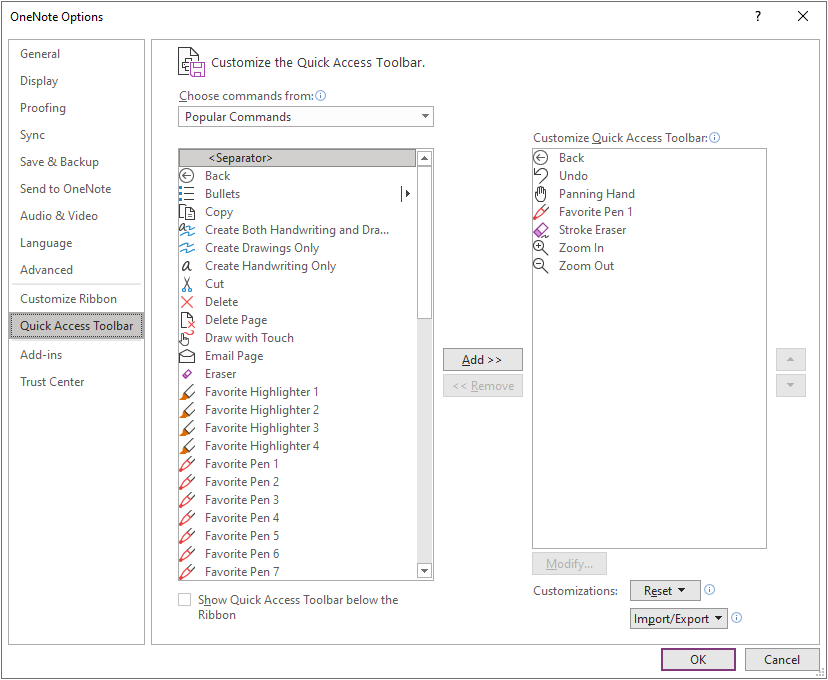
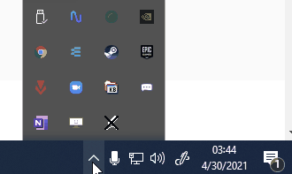

# OneNote Drawing Shortcuts
Use drawing software keybinds with OneNote 365.

# Setup
- Open OneNote 365 (not OneNote Windows 10)
- File -> Options -> Quick Access Toolbar
- Add in the following order:
    - Panning Hand
    - Favorite Pen 1
    - Stroke Eraser
    - Zoom In
    - Zoom Out
- The options should look like this:

    
- Set tablet buttons to "[" for Zoom In and "]" for Zoom Out.
- Run DrawingShortcuts.exe and move it to the taskbar to know if the program is disabled.
    - The program is disabled when the icon has an X on top.

        
- To start the program with Windows, create a shortcut of DrawingShortcuts.exe and put it in the startup folder:
    - %appdata%\Microsoft\Windows\Start Menu\Programs\Startup

# How to use
To change shortcuts, you will have to edit the DrawingShortcuts.ahk file.

| Shortcut | Keybind |
| --- | --- |
| Toggle Program | CTRL+SHIFT+Z |
| Panning Hand (While Holding) | SPACE |
| Favorite Pen 1 | V |
| Stroke Eraser | E |
| Zoom In | [ |
| Zoom Out | ] |